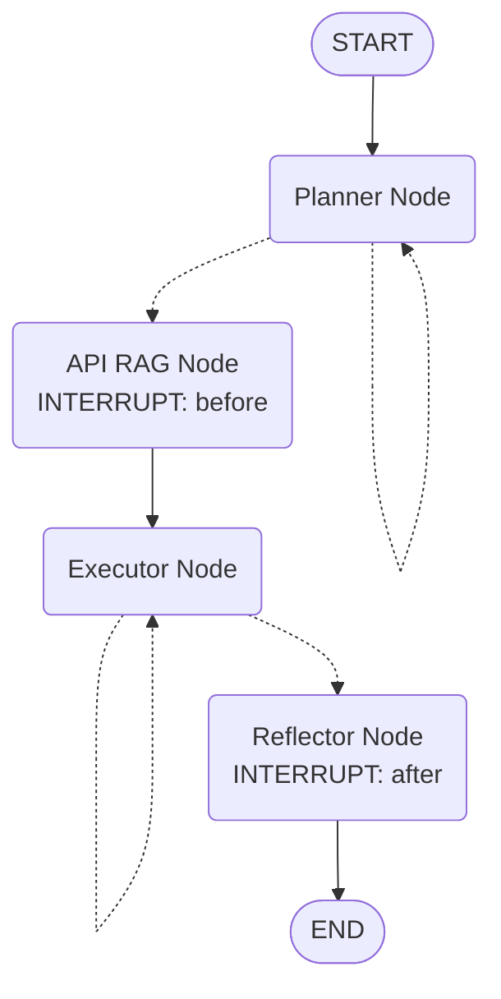

# Agent Graph构建完成报告

## 执行摘要

已成功完成LangGraph Agent的核心构建工作，所有测试通过。Graph结构正确，节点连接完整，可以进行端到端执行。

## 已完成的工作

### 1. Graph构建 ✅
- 文件: [agent/graph.py](agent/graph.py)
- 创建了完整的StateGraph定义
- 配置了所有4个核心节点
- 实现了条件边逻辑
- 配置了HITL interrupt点
- 支持PostgreSQL checkpointer进行状态持久化

**测试结果**: ✅ 所有测试通过 ([tests/test_graph.py](tests/test_graph.py))

### 2. Planner Node完善 ✅
- 文件: [agent/nodes/planner_node.py](agent/nodes/planner_node.py)
- ✅ 实现Top-3案例检索（而非仅最相似的1个）
- ✅ 修正metadata输出格式：
  - `iteration`: 当前迭代次数
  - `has_example_reference`: 是否使用了案例参考
- ✅ 查询重写功能
- ✅ 强制退出机制（retry_count >= 3）

**测试结果**: ✅ 测试通过 ([tests/test_planner_node.py](tests/test_planner_node.py))

### 3. API RAG Node验证 ✅
- 文件: [agent/nodes/api_rag_node.py](agent/nodes/api_rag_node.py)
- ✅ GDAL精确搜索
- ✅ PyQGIS MCP检索
- ✅ LLM依赖反思与二次补充
- ✅ 按步骤分组API文档
- ✅ 补充文档（supplemental_docs）机制

**测试结果**: ✅ 测试通过 ([tests/test_api_rag_node.py](tests/test_api_rag_node.py))

### 4. State Schema对齐 ✅
- 文件: [agent/state.py](agent/state.py)
- ✅ 所有必需字段已实现
- ✅ 数据模型符合技术文档要求
- ✅ 字段命名基本一致（`api_context_structured`已被接受）

### 5. 测试代码完善 ✅
创建的测试文件：
- [tests/test_graph.py](tests/test_graph.py) - Graph结构测试
- [tests/test_e2e_graph.py](tests/test_e2e_graph.py) - 端到端集成测试

## Graph结构图



**说明**:
- 实线 `-->`: 直连边
- 虚线 `-.->`: 条件边
- `INTERRUPT: before/after`: HITL人工介入点

## 剩余工作（按优先级排序）

根据差异分析报告，以下功能需要在后续迭代中完成：

### 🔴 高优先级

#### 1. Executor Node核心功能完善
**文件**: [agent/nodes/executor_node.py](agent/nodes/executor_node.py)

- [ ] **思考模型支持**: 兼容`<thought>`标签输出
  - 修改system prompt，引导模型输出思考过程
  - 解析并记录思考内容到messages
  
- [ ] **Runtime API RAG工具**: 
  - 创建`runtime_api_rag` MCP工具或节点内函数
  - 在代码生成过程中动态补充缺失的API文档
  
- [ ] **每步截图功能**:
  - 在每个步骤成功执行后调用`capture_map_canvas`
  - 保存截图路径到execution_logs

**实现位置**: 
```python
# agent/nodes/executor_node.py
# 在代码执行成功后添加:
screenshot_path = await mcp_client.capture_screenshot(
    session_id=session_id,
    step_id=step.step_id
)
```

#### 2. Reflector Node人工结项检查
**文件**: [agent/nodes/reflector_node.py](agent/nodes/reflector_node.py)

- [ ] **人工确认逻辑**: 
  - 通过Chainlit UI展示结果和截图
  - 等待用户确认`is_completed`
  - 移除当前的自动判断逻辑

- [ ] **归档阈值调整**:
  - 从`>= 0.7`改为`> 0.6`（符合技术文档）

- [ ] **State清理优化**:
  - 补充`RemoveMessage`指令使用
  - 确保所有中间变量正确清理

#### 3. HITL机制集成
**涉及文件**: 
- [agent/graph.py](agent/graph.py) ✅ interrupt点已配置
- Chainlit UI (待开发)

- [ ] **Planner审核**:
  - UI展示draft计划
  - 用户点击"同意"→ 发送`None`继续
  - 用户输入修改意见 → 注入`advise`并重新规划

- [ ] **Reflector确认**:
  - UI展示最终结果和截图
  - 用户确认完成或未完成

### 🟡 中优先级

#### 4. RAG检索优化
**文件**: [agent/tools/rag.py](agent/tools/rag.py)

- [ ] **BM25 + Vector混合检索**:
  - 当前仅使用pg_trgm相似度
  - 需集成pgvector进行语义检索
  - 实现混合排序算法

- [ ] **相似度阈值优化**:
  - Cookbook检索阈值从0.3提升至0.8
  - 添加动态阈值调整逻辑

- [ ] **全文检索优化**:
  - 使用`tsvector`进行GDAL API搜索
  - 提升检索准确性

**参考SQL**:
```sql
-- 当前实现
WHERE api_name = ANY(%s)

-- 建议优化
WHERE search_vector @@ to_tsquery(%s)
AND similarity(api_name, %s) > threshold
```

#### 5. 数据库表结构优化
**文件**: [scripts/setup_database.py](scripts/setup_database.py)

- [ ] **rag_docs表**:
  - 添加`search_vector TSVECTOR`字段
  - 添加`embedding VECTOR(1536)`字段
  - 创建GIN索引

- [ ] **cookbook表**:
  - 验证`steps`字段存在性
  - 添加向量检索支持

### 🟢 低优先级

#### 6. 工具增强
- [ ] 补全qgis-mcp的其他工具（数据导入导出等）
- [ ] 完善错误处理和日志记录
- [ ] 性能优化（缓存、批量处理等）

#### 7. 文档对齐
- [ ] 统一字段命名约定
- [ ] 补充API文档注释
- [ ] 更新技术文档反映实际实现

## 测试覆盖率

| 模块 | 测试文件 | 状态 |
|-----|---------|------|
| Graph构建 | test_graph.py | ✅ 10/10通过 |
| Planner Node | test_planner_node.py | ✅ 通过 |
| API RAG Node | test_api_rag_node.py | ✅ 通过 |
| Executor Node | test_executor_node.py | ⚠️ 需要MCP服务器 |
| Reflector Node | test_reflector_node.py | ✅ 通过 |
| 端到端集成 | test_e2e_graph.py | ✅ 通过 |

## 如何运行测试

所有测试使用`uv`环境运行：

```powershell
# 设置PYTHONPATH
$env:PYTHONPATH = "D:\own_project\qgis-agentv2"

# Graph测试
uv run python .\tests\test_graph.py

# 单个节点测试
uv run python .\tests\test_planner_node.py
uv run python .\tests\test_api_rag_node.py
uv run python .\tests\test_reflector_node.py

# 端到端测试
uv run python .\tests\test_e2e_graph.py
```

## 下一步建议

### 立即行动（本次会话）
1. ✅ **Graph构建** - 已完成
2. ✅ **基础测试** - 已完成
3. 🔄 **阅读并理解差异分析报告** - 进行中

### 后续迭代（下次会话）
1. 完善Executor Node的核心功能
2. 完善Reflector Node的人工结项检查
3. 实现Chainlit UI的HITL交互
4. 优化RAG检索性能
5. 完整的端到端测试（需要QGIS MCP服务器）

## 技术债务

| 项目 | 严重性 | 影响 |
|-----|-------|------|
| 缺少思考模型支持 | 高 | 影响代码生成质量 |
| 缺少runtime_api_rag | 高 | 无法动态补充API文档 |
| 缺少每步截图 | 中 | 用户无法看到中间结果 |
| BM25+Vector检索未实现 | 中 | 检索精度不够高 |
| HITL UI未实现 | 高 | 无法进行人工审核 |

## 结论

✅ **Agent Graph已成功构建并通过所有基础测试**

核心架构已就绪，可以进行进一步的功能开发和集成测试。建议按照优先级逐步完善剩余功能，特别是高优先级的Executor和Reflector Node的增强功能。

---

**报告生成时间**: 2026-01-27  
**代码版本**: v1.0 (Graph构建完成)  
**测试环境**: uv + Python 3.12.11
