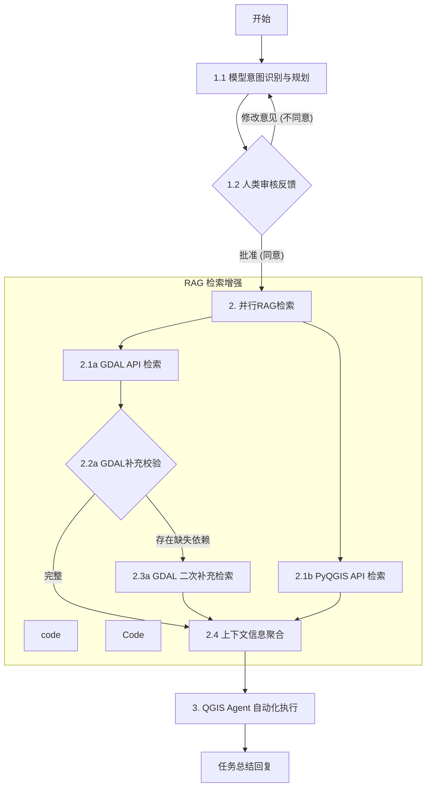

# PRD

# QGIS Agent 产品需求文档

## 1. 项目概述 

本项目旨在开发一个基于自然语言交互的 QGIS Agent。用户可以通过自然语言指令，让 Agent 自动调用 QGIS 的 GDAL 和 PyQGIS API，执行数据处理、图层展示等操作，极大地降低用户使用 QGIS 进行复杂操作的门槛。

## 2. 用户故事

- **输入：**  用户以自然语言形式提供任务指令，例如：“帮我加载 /path/to/data.shp 这个矢量图层，并将其投影转换为 EPSG:4326，然后根据 POPULATION 字段进行分级渲染。”
- **用户类型：**  QGIS 用户，包括本地桌面用户和潜在的远程服务用户。
- **价值：**  提升 QGIS 使用效率，降低学习曲线，实现复杂地理空间任务的自动化。
- **期望输出：**

  - QGIS 软件中成功执行对应的操作（例如：图层加载、处理、展示、保存项目等）
  - Agent 能够提供任务完成的总结性回复或结果确认。
  - 可视化截图直观输出

## 3. 工作流描述 (Workflow / Graph Topology)

QGIS Agent 的核心工作流基于一个多阶段的 Agent 协调机制，其主要流程如下：

### 阶段一：意图识别与规划

**1.开始 (Start):**  用户输入自然语言任务指令。  
**2.模型意图识别与规划 (PlanLLM):**

- Agent 使用一个“思考调用工具模型”来理解用户意图。
- 输出一个 JSON 文件，其中包含：

  - task: 整体任务描述。
  - steps:

    - step_decription：具体每个子步骤的详细描述。
    - gdal & pyqgis api: 每个步骤可能需要用到的 GDAL 或 PyQGIS 方法/API 名称。
- **拟定工具：**

  - **案例 Cookbook 混合 RAG：**  利用预先整理的案例库和 Cookbook 进行检索，帮助模型理解和规划。

‍

**3.人类审核反馈 (HumanReview):**

- Agent 会将生成的规划方案展示给用户。
- 如果用户不同意： 提供修改意见，流程返回到“模型意图识别与规划”阶段，重新进行规划。
- 如果用户批准： 流程进入下一阶段。

‍

### 阶段二：RAG 检索增强

**1.并行 RAG 检索 (ParallelRAG):**  根据阶段一规划中识别出的 GDAL 和 PyQGIS API 名称，并行执行详细文档检索。

- **GDAL API 检索 (GDAL_Search):**  基于本地 GDAL 文档进行关键词检索，获取相关 API 详细信息。

  - **GDAL 补充校验 (GDAL_Check):**
  - 对 GDAL 首次检索结果进行校验，判断是否存在缺失的关键依赖或信息。如果存在缺失依赖 (存在缺失依赖): 触发GDAL 二次补充检索 ，使用 LLM 基于首次查询结果进行二次查询，以获取更完整的文档。如果完整 (完整): GDAL 检索结果准备就绪。
- **PyQGIS API 检索 (PyQGIS_Search):**  基于网页和规则进行解析和关键词检索，获取相关 PyQGIS API 详细信息。

‍

**2.上下文信息聚合：** 将 GDAL (包括二次检索结果，如果发生) 和 PyQGIS 的所有相关 API 文档聚合，形成 Agent 执行阶段所需的完整上下文信息。

‍

### 阶段三：QGIS Agent 自动化执行

- Agent 使用一个“思考调用工具模型”作为其核心执行器。
- **System 提示上下文：**  接收阶段一的规划步骤和阶段二聚合的全部 API 文档作为其上下文。
- **工具：**

  - **代码运行：**  能够执行按照计划步骤拆解的逻辑代码块（非完整的单一文件，也非单行代码）。
  - **RAG API 后查询：**  在实际代码编写过程中，如果模型发现需要起初规划中没有提及的 API，可以进行实时的 RAG 补充查询，以确保代码的稳定性。
  - **其他工具：**  例如数据导入导出、QGIS 项目保存打开等，以支持完整的 QGIS 操作。
- **任务总结回复 (Answer):**  Agent 执行完毕后，向用户提供任务执行结果的总结或确认信息。

## 4. 成功标准 

- **核心功能：**  能够成功处理的常见 QGIS 数据处理和图层展示任务（例如：加载图层、投影转换、属性查询、基本渲染等）。
- **鲁棒性：**  在遇到不明确或错误指令时，能够友好地提示用户或进入人工干预流程。
- **其他具体可量化的指标：**

  - 生成代码的正确率。
  - RAG 检索的召回率和准确率。
  - 平均任务完成时间。

‍

‍

# QGIS Agent 产品需求文档 (v1.1)

## 1. 项目概述

本项目旨在开发一个基于自然语言交互且具备自我进化能力的 QGIS Agent。用户可以通过自然语言指令，让 Agent 自动调用 QGIS 的 GDAL 和 PyQGIS API，执行数据处理、图层展示等操作。

**项目特点：**

进化性：系统能够从成功的历史任务中扩充案例库，从而不断提升意图识别与规划的准确率。

面向API文档检索改进：当前LLM大致能够完成GDAL和PyQGIS相关的代码写作，但相关的细节往往缺乏。具体体现为，能够知道调用什么api，但是api的具体参数较易出现幻觉

## 2. 用户故事

- **输入：**  用户以自然语言形式提供任务指令。
- **用户类型：**  QGIS 用户（本地桌面/远程服务）。
- **价值：**  降低 QGIS 使用门槛，实现自动化，并**随着使用次数增加，对复杂指令的理解越来越精准**。此外，面向API文档检索改进，降低agent执行错误概率
- **期望输出：**

  - QGIS 软件中成功执行操作。
  - 任务完成总结回复。
  - 可视化截图。
  -  **（后台）成功的操作逻辑被自动归档为新的参考案例。**

## 3. 工作流描述 (Workflow / Graph Topology)

QGIS Agent 的核心工作流基于一个多阶段的 Agent 协调机制，并包含一知识回流闭环：

### 阶段一：意图识别与规划

**1. 开始 (Start):**  用户输入自然语言任务指令。  
**2. 模型意图识别与规划 (PlanLLM):**

- Agent 使用一个“思考调用工具模型”来理解用户意图。
- **拟定工具（关键修改）：**

  - **动态案例 Cookbook 混合 RAG：**  检索预先整理的静态案例库，以及系统自动存储的历史成功案例（Evolved Memory）。模型通过对比当前任务与历史相似成功案例，生成更精准的计划。
- 输出一个 JSON 文件，包含：

  - task: 整体任务描述。
  - steps: 包含 step\_description 和拟用的 gdal/pyqgis api。

**3. 人类审核反馈 (HumanReview):**

- 展示规划方案。
- **同意：**  进入下一阶段。
- **不同意：**  提供反馈，回退重做。

### 阶段二：RAG 检索增强

**1. 并行 RAG 检索 (ParallelRAG):**  根据规划的 API 名称进行文档检索。

- **GDAL API 检索:**  本地文档关键词检索 + 补充校验机制（依赖缺失时触发二次 LLM 检索）。
- **PyQGIS API 检索:**  网页规则解析 + 关键词检索。

**2. 上下文信息聚合:**  聚合所有文档，形成执行阶段的上下文。

### 阶段三：QGIS Agent 自动化执行

- **核心执行器:**  “思考调用工具模型”。
- **System 上下文:**  规划步骤 + 聚合的 API 文档。
- **工具:**

  - **代码运行:**  执行逻辑代码块。
  - **RAG API 后查询:**  运行时查漏补缺。
  - **其他工具:**  数据导入导出、项目保存等。
- **任务总结回复 (Answer):**  向用户反馈执行结果。

### **阶段四：自我进化与知识沉淀 (Self-Evolution)**  

**1. 成功判定 (SuccessGate):**

- 系统检查阶段三的执行结果（无报错且用户/校验脚本标记为成功）。
- 如果任务失败，流程结束（不进行沉淀）。

**2. 案例概括与存储 (KnowledgeDistillation):**

- **输入：**  原始用户指令 + 最终生成的有效代码 + 执行计划。
- **处理 (LLM):**  调用模型将本次任务概括为标准的“问题-解决方案”对（Q&A Pair），去除冗余的尝试过程，提取核心逻辑。
- **存储:**  将概括后的内容向量化，存入动态 Cookbook 向量库，供阶段一再次使用。

## 4. 成功标准

- **核心功能：**  常见 QGIS 任务的成功执行。
- **进化能力指标：**  随着相似任务的重复，Agent 在阶段一生成的规划准确率（Pass Rate）应呈上升趋势，人工修改率下降。
- **鲁棒性：**  错误处理与用户引导。

‍

‍

# QGIS Agent 产品需求文档 (v1.2)

## 1. 项目概述

本项目旨在开发一个基于自然语言交互的 QGIS Agent。用户可以通过自然语言指令，让 Agent 自动调用 QGIS 的 GDAL 和 PyQGIS API，执行数据处理、图层展示等操作。

**核心创新点：**

*. **面向参数精度的 RAG 改进：**  针对 LLM “知道调什么 API 但常写错参数”的痛点，设计了二次检索与校验机制，确保 API 调用的参数（Arguments/Keywords）准确无误，消除幻觉。  
*. **自我进化能力：**  系统构建了知识闭环，能够从成功的历史任务中自动提炼逻辑并扩充案例库（Cookbook），随着使用次数增加，意图识别与规划能力呈螺旋式上升。

## 2. 用户故事

- **输入：**  用户以自然语言形式提供任务指令。
- **用户类型：**  QGIS 用户（本地桌面/远程服务）。
- **价值：**

  - **极低的执行错误率：**  通过改进的 API 文档检索，解决 PyQGIS/GDAL 复杂参数容易写错的问题。
  - **自动化与成长性：**  降低 QGIS 门槛，且 Agent 对复杂指令的理解能力随使用时长而增强。
- **期望输出：**

  - QGIS 软件中成功执行操作。
  - 任务完成总结回复。
  - 可视化截图。
  -  **（后台）成功的操作逻辑被自动归档为新的参考案例。**

## 3. 工作流描述 (Workflow / Graph Topology)

QGIS Agent 的核心工作流基于一个多阶段的 Agent 协调机制，集成**参数级 RAG 校验**与**知识回流**：

### 阶段一：意图识别与规划 (Intent & Planning)

**1. 开始 (Start):**  用户输入自然语言任务指令。  
**2. 模型意图识别与规划 (PlanLLM):**

- **输入：**  用户指令 + ​**动态案例 Cookbook（包含历史成功经验）** 。
- **处理：**  识别用户意图，生成分步执行计划。
- **输出：**  JSON 格式的计划书，包含 task（总任务）、steps（步骤）以及关键的 target_methods（拟调用的 API 名称，如 processing.run, QgsVectorLayer）。  
  **3. 人类审核反馈 (HumanReview):**  用户批准或修改计划。

### 阶段二：精密 RAG 检索与参数校验 (Precision RAG & Validation)

目标：不仅仅找到 API 文档，而是锁定该 API 的具体参数列表和数据类型。

**1. 并行 RAG 检索 (ParallelRAG):**

- **输入：**  阶段一规划出的 target\_methods 列表。
- **GDAL API 检索:**

  - 检索本地/在线 GDAL 文档。
  - **参数完备性检查 (GDAL_Check):**  检查检索到的内容是否包含具体的函数签名和参数说明。
  - **二次补充检索 (GDAL_Supp):**  若首次检索仅返回概览而缺失参数细节，触发 LLM 进行二次精准搜索（针对参数）。
- **PyQGIS API 检索:**

  - 基于规则解析 PyQGIS 网页文档，重点提取 Parameters, Returns 和 Code Snippets 章节。

**2. 上下文信息聚合 (ContextMerge):**

- 将经过校验的、包含**准确参数定义**的 API 文档片段聚合。

### 阶段三：QGIS Agent 自动化执行 (Execution)

- **核心执行器:**  “思考调用工具模型”。
- **System 上下文:**  规划步骤 + ​**参数级详细 API 文档**。
- **工具:**

  - **代码运行:**  执行逻辑代码块。
  - **Runtime RAG 补救:**  在写代码时，如果发现仍有未覆盖的子函数（例如某个生僻的枚举值），允许 Agent 在运行时发起补充查询。
  - **QGIS 交互:**  数据 I/O、项目管理等。
- **任务总结回复 (Answer):**  反馈执行结果。

### 阶段四：自我进化与知识沉淀 (Self-Evolution)

**1. 成功判定 (SuccessGate):**  检查执行是否无误完成。  
**2. 案例概括与存储 (KnowledgeDistillation):**

- **输入：**  原始指令 + 最终成功的代码 + 参数配置。
- **处理:**  提炼核心逻辑，生成“问题-代码”对。
- **存储:**  存入向量库，作为阶段一的“动态 Cookbook”来源。

## 4. 成功标准

- **API 调用准确率：**  生成的代码中，函数参数名拼写错误、参数类型错误（如传了字符串但需要字典）的比例显著降低。
- **一次通过率 (Pass@1)：**  无需人工介入修改代码即可运行成功的任务比例。
- **进化有效性：**  后续类似任务的规划耗时减少，准确度提升。
