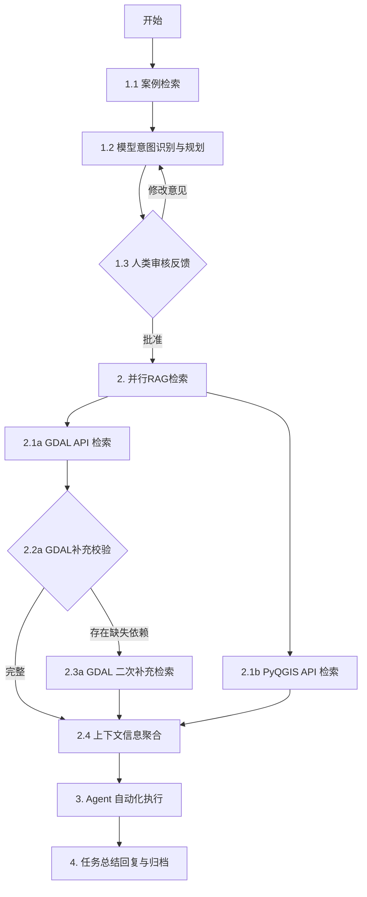

# Agent节点实现与技术文档差异分析报告

## 执行摘要

当前代码已完成所有四个核心节点的基础实现，但与技术文档相比仍存在多处功能缺失。Graph构建尚未开始。本报告详细分析各节点、State定义、工具模块与文档的差异，便于后续修改。

---

## 1. State Schema 差异分析

### 1.1 已实现字段 ✅

**完全符合文档要求的基础字段：**
- `input_query`: 用户的原始地理处理需求
- `session_id`: 会话ID
- `log_summary`: 之前轮次的任务执行总结
- `advise`: 用户在审核阶段提出的修改意见
- `example`: 从Cookbook检索到的相似案例
- `draft`: 模型当前生成的草稿方案
- `plan`: 最终确认执行的方案
- `status`: 方案审核状态
- `retry_count`: 人工审查/修改的循环次数
- `gdal_doc`: 检索到的GDAL API文档
- `pyqgis_doc`: 检索到的PyQGIS API文档
- `api_context_structured`: 按步骤分段的结构化API文档
- `missing_deps`: LLM反思发现的缺失依赖API
- `messages`: 包含AI思考、代码输出及执行结果
- `current_step_id`: 当前正在执行的步骤索引
- `execution_logs`: 记录每步的成功/失败状态
- `retry_attempts`: 当前步骤的自我纠错次数
- `final_summary`: 任务完成后的总结
- `screenshot_path`: 最新生成的截图文件路径
- `is_completed`: 用户人工认定的任务成功完成状态
- `quality_score`: LLM对本次任务的价值评分

**额外实现的字段：**
- `code_history`: 每步生成的代码历史（文档未明确要求，但实现中增加了）

### 1.2 字段命名差异 ⚠️

| 文档字段名 | 实现字段名 | 影响 |
|----------|----------|------|
| `api_context` | `api_context_structured` | 命名更清晰，但需要确保文档一致性 |
| `log_summary` (Reflector输出) | `final_summary` + `log_summary` | 实现中同时保留了两个字段 |

### 1.3 数据模型差异

**文档要求：**
```json
{
  "relevant_docs": [
    {
      "api_name": "gdal.Warp",
      "library": "GDAL",
      "content": "API文档片段中所有信息，无需按照description等进一步划分"
    }
  ]
}
```

**当前实现：**
```python
class RelevantDoc(BaseModel):
    api_name: str = Field(description="API名称")
    library: str = Field(description="库类型: GDAL or PyQGIS")
    content: str = Field(description="API文档完整内容")
```

**差异说明：** 当前实现符合文档要求，使用统一的`content`字段存储完整API信息。

---

## 2. Planner Node 差异分析

### 2.1 已实现功能 ✅

1. ✅ 查询重写（Query Rewriting）
2. ✅ Cookbook检索（首次规划时）
3. ✅ Few-Shot Generation（相似案例注入）
4. ✅ 人工审核节点基础逻辑
5. ✅ 强制退出机制（retry_count >= 3）
6. ✅ JSON格式输出规约

### 2.2 功能缺失 ❌

| 文档要求 | 实现状态 | 严重性 | 说明 |
|---------|---------|--------|------|
| **BM25 + Vector混合检索** | ❌ 未实现 | 中 | 当前仅使用pg_trgm相似度搜索，未实现向量检索 |
| **Similarity Score > 0.8阈值过滤** | ❌ 未实现 | 低 | 代码中使用固定阈值0.3，未实现0.8高匹配度过滤 |
| **interrupt_before机制** | ❌ 未实现 | 高 | 未集成LangGraph的interrupt机制，无法实现人工审核暂停 |
| **Top-3案例选择** | ⚠️ 部分实现 | 低 | 检索了3个案例，但仅使用最相似的1个 |

### 2.3 实现差异

**文档要求：**
```json
{
  "steps": [
    {
      "step_id": 1,
      "description": "步骤描述",
      "gdal_api": ["gdal.Warp"],
      "pyqgis_api": ["QgsCoordinateReferenceSystem"]
    }
  ],
  "metadata": {
    "iteration": 1,
    "has_example_reference": true
  }
}
```

**当前实现：**
```python
system_prompt中要求输出：
{
  "metadata": {
    "estimated_complexity": "low/medium/high",
    "requires_data": true/false
  }
}
```

**差异：**
1. `metadata.iteration` - 文档要求，当前未要求输出
2. `metadata.has_example_reference` - 文档要求，当前未要求输出
3. `metadata.estimated_complexity` - 实现新增，文档未要求
4. `metadata.requires_data` - 实现新增，文档未要求

### 2.4 LLM提示差异

**文档要求：**
> "注意生成的规划不要拆分太细，每个步骤是中低复杂的目标"

**当前实现：**
> "步骤不要拆分太细，每个步骤应该是中低复杂度的目标"

**说明：** 提示意图一致，但表述略有不同。

---

## 3. API RAG Node 差异分析

### 3.1 已实现功能 ✅

1. ✅ 从plan中提取所有GDAL/PyQGIS API名称
2. ✅ 并行检索（GDAL数据库 + PyQGIS MCP）
3. ✅ LLM依赖反思与二次补充
4. ✅ 按步骤分组API文档
5. ✅ 缺失API检测与记录

### 3.2 功能缺失 ❌

| 文档要求 | 实现状态 | 严重性 | 说明 |
|---------|---------|--------|------|
| **PostgreSQL全文检索（FTS）** | ⚠️ 部分实现 | 中 | 实现了精确搜索，未明确使用tsvector全文检索 |
| **补充文档的supplemental_docs** | ✅ 已实现 | - | 已实现并添加到StepContext |
| **二次补充后的递归反思** | ❌ 未实现 | 低 | 仅执行一次LLM反思，未实现递归检查 |

### 3.3 数据格式差异

**文档要求的输出格式：**
```json
{
  "api_context_structured": [
    {
      "step_id": 1,
      "relevant_docs": [
        {
          "api_name": "gdal.Warp",
          "library": "GDAL",
          "content": "Image reprojection and warping utility.....(API文档片段中所有信息包括description，parameter，example)"
        }
      ]
    }
  ]
}
```

**当前实现：**
```python
class StepContext(BaseModel):
    step_id: int = Field(description="步骤ID")
    relevant_docs: List[RelevantDoc] = Field(default_factory=list)
    supplemental_docs: List[RelevantDoc] = Field(default_factory=list)  # 额外字段
```

**差异：** 实现中增加了`supplemental_docs`字段，用于存储补充的依赖API文档，这是合理的增强。

### 3.4 检索逻辑差异

**文档要求：**
```python
# 使用tsvector匹配函数名
SELECT * FROM rag_docs
WHERE library_name = 'GDAL'
AND method_name = ANY(list)
```

**当前实现：**
```python
# 使用精确匹配
cur.execute(
    """
    SELECT api_name, description, params, example_code, doc_type as library
    FROM rag_docs
    WHERE api_name = ANY(%s)
    AND doc_type = 'gdal'
    ORDER BY api_name
    """,
    (method_names,)
)
```

**差异：**
1. 字段名：文档要求`library_name`和`method_name`，实现中使用`doc_type`和`api_name`
2. 全文检索：文档要求使用`tsvector`，实现中仅使用精确匹配`ANY()`

---

## 4. Executor Node 差异分析

### 4.1 已实现功能 ✅

1. ✅ 上下文装配（提取当前步骤和API文档）
2. ✅ 推理与调用循环
3. ✅ 代码执行与观察（通过MCP）
4. ✅ 自主纠错机制
5. ✅ 最多3次重试限制
6. ✅ System Prompt约束（路径一致性、防御性编程等）

### 4.2 功能缺失 ❌

| 文档要求 | 实现状态 | 严重性 | 说明 |
|---------|---------|--------|------|
| **思考阶段（<thought>标签）** | ❌ 未实现 | 高 | 文档明确要求使用`<thought>`标记思考过程 |
| **动作选择（生僻函数->runtime_api_rag）** | ❌ 未实现 | 高 | 未实现运行时动态RAG补充功能 |
| **环境确认（inspect_qgis_env）** | ❌ 未实现 | 中 | 未实现环境检查工具调用 |
| **阶段性产出（每步后截图）** | ❌ 未实现 | 中 | 仅在Reflector生成最终截图，未在每步后截图 |
| **capture_map_canvas工具调用** | ❌ 未实现 | 高 | 虽然在Reflector中调用了截图工具，但未集成到Executor的每步执行中 |

### 4.3 工具集差异

**文档要求的工具集：**
1. `execute_code` - 代码运行 ✅ 已实现
2. `runtime_api_rag` - Runtime RAG补救 ❌ 未实现
3. `inspect_qgis_env` - QGIS环境检查 ❌ 未实现
4. `capture_map_canvas` - 截图工具 ⚠️ 仅Reflector使用

**当前实现的工具集：**
1. `execute_code` ✅ 通过`mcp_client.execute_code()`实现
2. `capture_map_canvas` ⚠️ 通过`mcp_client.capture_screenshot()`实现，但仅在Reflector中使用

### 4.4 System Prompt差异

**文档要求的核心准则：**
- 路径一致性 ✅ 已实现
- 防御性编程 ✅ 已实现
- API忠实度 ✅ 已实现
- 单步执行 ✅ 已实现

**文档要求的思考机制：**
```
**思考阶段 (<thought>)**：模型分析当前步骤目标，结合API文档思考是否存在环境风险
**动作选择**：
- 若文档完备：生成代码并调用execute_pyqgis
- 若发现生僻函数：优先调用runtime_api_rag
- 若需要环境确认：调用inspect_qgis_env
```

**当前实现：**
- ❌ 未实现`<thought>`标签机制
- ❌ 未实现条件化的动作选择逻辑
- ✅ 直接生成代码并执行

---

## 5. Reflector Node 差异分析

### 5.1 已实现功能 ✅

1. ✅ 执行结果总结（LLM生成）
2. ✅ 价值判断与归档（quality_score评估）
3. ✅ 质量评分>=0.6时归档到Cookbook
4. ✅ 生成截图（通过MCP）
5. ✅ 状态清理（按文档清单）

### 5.2 功能缺失 ❌

| 文档要求 | 实现状态 | 严重性 | 说明 |
|---------|---------|--------|------|
| **人工结项检查（HITL）** | ❌ 未实现 | 高 | 文档要求人工确认`is_completed`，当前自动判断 |
| **interrupt_after机制** | ❌ 未实现 | 高 | 未集成LangGraph的interrupt机制 |
| **RemoveMessage指令** | ❌ 未实现 | 中 | 文档提到批量删除旧消息，当前直接重置列表 |
| **quality_score > 0.6阈值** | ⚠️ 实现差异 | 低 | 文档要求>0.6归档，实现中>=0.7归档 |

### 5.3 状态清理差异

**文档要求的清理清单：**

| 需清理的字段 | 实现状态 | 保留的字段 |
|------------|---------|----------|
| `draft` | ✅ 已清理 | `log_summary` ✅ |
| `plan` | ✅ 已清理 | `screenshot_path` ✅ |
| `api_context` | ✅ 已清理（使用`api_context_structured`） | `input_query` ✅ |
| `execution_logs` | ✅ 已清理 | `is_completed` ✅ |
| `verified_code` | N/A（未实现该字段） | - |
| `advise` | ✅ 已清理 | - |
| `retry_count` | ✅ 已清理 | - |
| `status` | ✅ 已清理 | - |
| `example` | ✅ 已清理 | - |
| `missing_deps` | ✅ 已清理 | - |
| `messages` | ✅ 已清理 | - |

**差异：**
1. 实现中额外清理了`gdal_doc`、`pyqgis_doc`、`code_history`等字段
2. 文档中提到的`verified_code`字段在State中未定义

### 5.4 归档条件差异

**文档要求：**
> "LLM根据代码深度打分，若quality_score > 0.6，提取核心逻辑存入Cookbook"

**当前实现：**
```python
if is_success and quality_score >= 0.7:
    # 归档到Cookbook
```

**差异：** 阈值从>0.6改为>=0.7，略微提高了归档标准。

---

## 6. Graph构建差异分析

### 6.1 状态

**完全未实现** ❌

当前代码仅实现了四个独立节点，尚未进行Graph的组装和节点间的连接。

### 6.2 文档要求的Graph结构



### 6.3 需要实现的Graph功能

| 功能 | 优先级 | 说明 |
|-----|-------|------|
| **StateGraph初始化** | 高 | 创建StateGraph实例 |
| **节点注册** | 高 | 将4个节点注册到Graph中 |
| **边连接** | 高 | 定义节点间的流转逻辑 |
| **条件边** | 高 | 实现Human Review的条件判断 |
| **循环边** | 高 | 实现Planner的修改意见循环 |
| **interrupt机制** | 高 | 实现HITL的interrupt_before和interrupt_after |
| **Checkpoint配置** | 高 | 配置PostgresSaver实现状态持久化 |
| **启动与执行** | 高 | 实现Graph的启动和调度逻辑 |

---

## 7. 工具模块差异分析

### 7.1 RAG工具（agent/tools/rag.py）

**已实现功能 ✅：**
- ✅ `search_gdal_docs()` - GDAL精确搜索
- ✅ `search_gdal_docs_fuzzy()` - GDAL模糊搜索（额外实现）
- ✅ `search_cookbook()` - Cookbook相似案例搜索
- ✅ `search_pyqgis_docs()` - PyQGIS MCP搜索
- ✅ `search_all_apis_by_keywords()` - 关键词搜索（额外实现）

**功能差异 ⚠️：**
1. 文档要求使用BM25 + Vector混合检索，当前仅使用pg_trgm相似度
2. 文档要求Similarity Score > 0.8，当前使用固定阈值0.3
3. GDAL搜索使用精确匹配，未使用`tsvector`全文检索

### 7.2 数据库工具（agent/tools/database.py）

**已实现功能 ✅：**
- ✅ `save_execution_log()` - 保存执行日志
- ✅ `get_execution_logs()` - 获取执行日志
- ✅ `save_cookbook_entry()` - 保存Cookbook条目
- ✅ `update_cookbook_usage()` - 更新使用次数（额外实现）
- ✅ `get_cookbook_by_id()` - 根据ID获取条目（额外实现）

**符合文档要求 ✅：** 完全符合技术文档第2.3节"会话与日志管理"的要求。

### 7.3 MCP客户端工具（agent/tools/mcp_client.py）

**已实现功能 ✅：**
- ✅ SSE连接管理
- ✅ 工具调用（`call_tool()`）
- ✅ 代码执行（`execute_code()`）
- ✅ 截图功能（`capture_screenshot()`）
- ✅ 全局单例模式

**缺失工具 ❌：**
- ❌ `runtime_api_rag()` - 运行时动态RAG
- ❌ `inspect_qgis_env()` - QGIS环境检查

---

## 8. HITL（Human-in-the-Loop）差异分析

### 8.1 Planner Node HITL

**文档要求：**
1. ✅ 系统暂停，将draft展示在UI
2. ❌ 用户操作：批准/修改意见（未实现UI集成）
3. ✅ 强制退出机制（retry_count >= 3）

**缺失：**
- ❌ `interrupt_before=["api_rag_node"]` 未实现
- ❌ UI交互逻辑未实现

### 8.2 Reflector Node HITL

**文档要求：**
1. ❌ 系统展示回复及截图
2. ❌ 用户操作：确认完成/未完成
3. ❌ 设置`is_completed`状态

**缺失：**
- ❌ `interrupt_after=["reflector_node"]` 未实现
- ❌ UI交互逻辑未实现
- ❌ 当前自动判断`is_completed`，文档要求人工确认

---

## 9. 数据库差异分析

### 9.1 rag_docs表

**文档要求的字段：**
```sql
CREATE TABLE rag_docs (
    id SERIAL PRIMARY KEY,
    class_name VARCHAR(100),
    method_name VARCHAR(255),
    description TEXT,
    parameters JSONB,
    example_code TEXT,
    search_vector TSVECTOR,
    embedding VECTOR(1536)
);
```

**当前实现的字段：**
```python
# search_gdal_docs()返回的字段
SELECT api_name, description, params, example_code, doc_type as library
FROM rag_docs
```

**差异：**
1. 字段名：`method_name` → `api_name`
2. 字段名：`parameters` → `params`
3. 字段名：`library_name` → `doc_type`
4. 缺失：`class_name`、`search_vector`、`embedding`字段在查询中未使用
5. 缺失：`library_name`字段，文档中需要区分'GDAL'等库类型

### 9.2 cookbook表

**文档要求的字段：**
```sql
CREATE TABLE cookbook (
    id SERIAL PRIMARY KEY,
    user_intent TEXT,
    verified_code TEXT,
    tags TEXT[],
    complexity_score FLOAT,
    usage_count INT DEFAULT 1,
    created_at TIMESTAMP DEFAULT NOW()
);
```

**当前实现的查询：**
```python
SELECT id, user_intent, verified_code, tags,
       complexity_score, steps, usage_count,
       similarity(user_intent, %s) as similarity_score
FROM cookbook
```

**差异：**
- 额外查询了`steps`字段，文档中未明确该字段
- 其他字段完全符合

### 9.3 execution_logs表

**文档要求的字段：**
```sql
CREATE TABLE execution_logs (
    id SERIAL PRIMARY KEY,
    session_id VARCHAR(100) NOT NULL,
    step_id INT,
    message TEXT,
    status VARCHAR(20),
    timestamp TIMESTAMP DEFAULT NOW()
);
```

**当前实现的插入：**
```python
INSERT INTO execution_logs
(session_id, step_id, message, status, metadata)
VALUES (%s, %s, %s, %s, %s)
```

**差异：**
- 额外增加了`metadata`字段存储`error_detail`
- 字段命名：文档用`timestamp`，PostgreSQL自动使用`created_at`

---

## 10. 优先级修复建议

### 🔴 高优先级（核心功能缺失）

1. **Graph构建**
   - 创建StateGraph实例
   - 注册所有节点
   - 定义边和条件边
   - 配置Checkpoint（PostgresSaver）

2. **HITL机制**
   - Planner的`interrupt_before`
   - Reflector的`interrupt_after`
   - 人工审核状态管理

3. **Executor核心功能**
   - 实现`<thought>`思考标签机制
   - 实现运行时动态RAG（`runtime_api_rag`工具）
   - 每步执行后截图

### 🟡 中优先级（功能完善）

4. **RAG检索优化**
   - 实现BM25 + Vector混合检索
   - 调整相似度阈值至>0.8
   - 使用`tsvector`全文检索

5. **Planner完善**
   - 实现Top-3案例选择
   - 输出metadata中的`iteration`和`has_example_reference`

6. **Reflector完善**
   - 实现人工结项检查
   - 实现RemoveMessage指令
   - 调整归档阈值至>0.6

### 🟢 低优先级（优化增强）

7. **数据模型对齐**
   - 统一字段命名（`api_context` vs `api_context_structured`）
   - 补充metadata字段输出

8. **工具增强**
   - 实现`inspect_qgis_env`工具
   - 递归依赖检查

---

## 11. 实施建议

### 阶段1：Graph构建（1-2天）
- 创建`agent/graph.py`文件
- 实现StateGraph初始化、节点注册、边连接
- 配置PostgresSaver Checkpoint
- 编写Graph启动和执行逻辑

### 阶段2：HITL集成（2-3天）
- 实现interrupt机制
- 集成Chainlit UI交互逻辑
- 处理人工审核输入

### 阶段3：Executor功能完善（2-3天）
- 实现`<thought>`标签机制
- 开发`runtime_api_rag`工具
- 实现每步执行后截图

### 阶段4：RAG优化（1-2天）
- 实现向量检索（需要pgvector）
- 调整相似度阈值
- 优化全文检索逻辑

### 阶段5：细节完善（1-2天）
- 统一字段命名
- 补充metadata字段
- 测试与调试

**总预计工作量：7-12天**

---

## 附录：关键代码位置索引

| 功能模块 | 文件路径 | 关键函数/类 |
|---------|---------|------------|
| State定义 | `agent/state.py` | `AgentState`, `Plan`, `Step`, `StepContext` |
| Planner Node | `agent/nodes/planner_node.py` | `planner_node()` |
| API RAG Node | `agent/nodes/api_rag_node.py` | `api_rag_node()` |
| Executor Node | `agent/nodes/executor_node.py` | `executor_node()` |
| Reflector Node | `agent/nodes/reflector_node.py` | `reflector_node()` |
| RAG工具 | `agent/tools/rag.py` | `search_gdal_docs()`, `search_cookbook()`, `search_pyqgis_docs()` |
| 数据库工具 | `agent/tools/database.py` | `save_execution_log()`, `save_cookbook_entry()` |
| MCP客户端 | `agent/tools/mcp_client.py` | `QGISMCPClient`, `get_mcp_client()` |

---

**报告生成时间：** 2026-01-27
**代码版本：** 当前实现（Graph未构建）
**文档版本：** doc/技术文档.md（v1.0）
